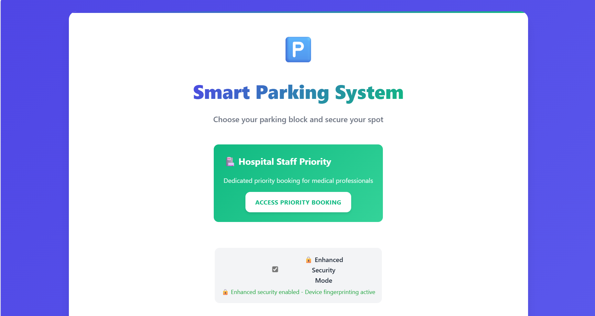
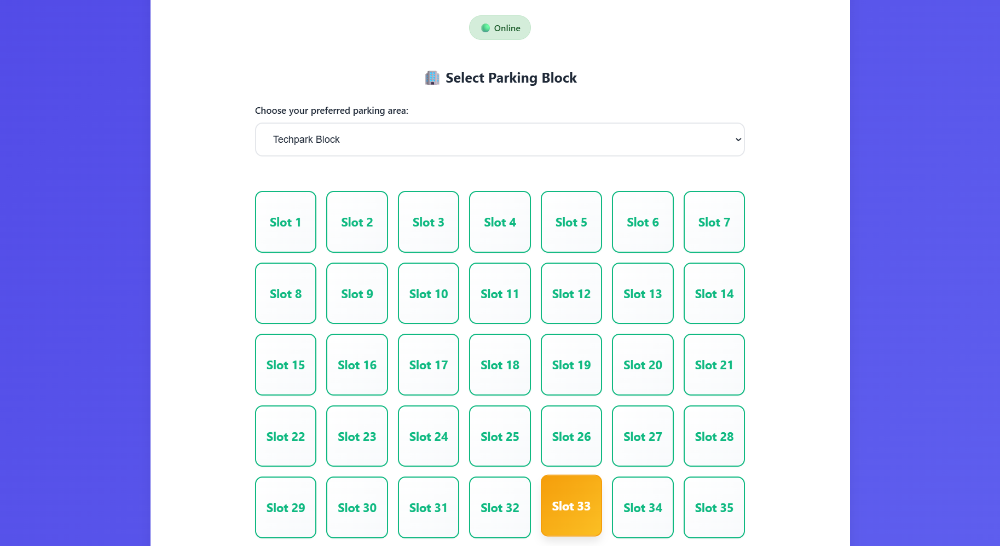
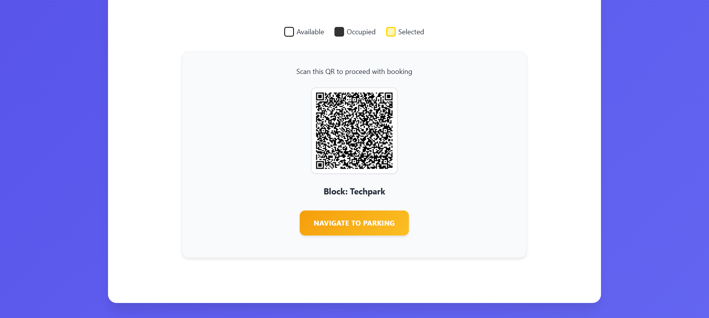
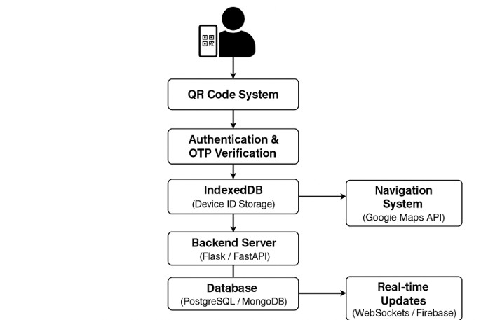

# 🅿️ Smart QR-Based Parking System

[](docs/CONFERENCE.md)
[](docs/CONFERENCE.md)
[](docs/CONFERENCE.md)

A modern, web-based parking management system with QR code generation, hospital priority booking, and Progressive Web App (PWA) capabilities. **Published and presented at IEEE CONIT 2025.**

## 🏆 IEEE Conference Publication

**📚 Published at:** [5th International Conference on Intelligent Technologies (CONIT 2025)](docs/CONFERENCE.md)  
**📅 Presented:** June 20-22, 2025  
**🏢 Venue:** K.L.E. Institute of Technology, Hubli, Karnataka, India  
**👥 Authors:** V. Niketh, J. Ravindra Chowdary  
**🏛️ Institution:** SRM Institute of Science and Technology  

[📖 View Full Conference Details](docs/CONFERENCE.md)

## 📸 System Screenshots

| Homepage | Slot Selection | QR Generation |
|----------|----------------|---------------|
|  |  |  |
| Main interface with priority access | Interactive slot selection grid | Generated QR with navigation |

## 🏗️ System Architecture



*Complete system architecture showing all components and data flow*

## ✨ Features

### 🚗 Core Parking System
- **Multi-Zone Parking**: Support for different parking blocks (TechPark, Medical, MBA, Java, FabLab, Dental)
- **Real-time Slot Management**: Live availability tracking with visual slot status
- **QR Code Generation**: Automatic QR code creation for booking and release
- **OTP Verification**: SMS-based verification for secure bookings
- **Device Fingerprinting**: Enhanced security with device tracking

### 🏥 Hospital Priority System
- **Staff Authentication**: Hospital staff ID verification system
- **Priority Levels**: 4-tier priority system for medical professionals
  - Level 1: Emergency Staff (Highest Priority)
  - Level 2: Senior Doctors
  - Level 3: Nurses, Professors
  - Level 4: Support Staff
- **Dedicated Slots**: Reserved priority slots for medical and dental staff
- **Fast-Track Booking**: Streamlined booking process for priority users

### 📱 Progressive Web App (PWA)
- **Offline Support**: Works without internet connection
- **Mobile Responsive**: Optimized for all screen sizes
- **Install Prompt**: Can be installed as a native app
- **Service Worker**: Background updates and caching
- **Push Notifications**: Real-time updates (configurable)

### 🎨 Modern UI/UX
- **Unified Design System**: Consistent color palette and components
- **Step Indicators**: Clear visual progress tracking
- **Responsive Layout**: Mobile-first design approach
- **Accessibility**: High contrast support and keyboard navigation
- **Loading States**: Smooth animations and feedback

## 🚀 Quick Start

### Prerequisites
- Python 3.8 or higher
- pip (Python package installer)

### Installation

1. **Clone the repository**
   ```bash
   git clone https://github.com/RAVINDRA8008/Smart-QR-Based-Parking-System-main.git
   cd Smart-QR-Based-Parking-System-main
   ```

2. **Install dependencies**
   ```bash
   pip install -r requirements.txt
   ```

3. **Set up environment variables** (Optional - for SMS functionality)
   ```bash
   # Copy the example file
   cp .env.example .env
   
   # Edit .env file with your credentials
   TWILIO_ACCOUNT_SID="your_twilio_account_sid"
   TWILIO_AUTH_TOKEN="your_twilio_auth_token" 
   TWILIO_FROM_PHONE="+1234567890"
   BASE_URL="http://localhost:5000/"
   ```

4. **Run the application**
   ```bash
   python app.py
   ```

### Alternative Setup (Windows)
   ```bash
   # Use the provided batch file for easy setup
   start.bat
   ```

5. **Access the application**
   - Open your browser and navigate to `http://localhost:5000`
   - For mobile testing: `http://your-ip:5000`

## 📋 Usage

### Regular Parking Booking
1. Visit the homepage and select a parking block
2. Choose an available slot (green slots)
3. Enter your phone number for OTP verification
4. Receive and enter the OTP code
5. Get your QR code for parking access

### Hospital Priority Booking
1. Click "Hospital Staff Priority" on the homepage
2. Enter your hospital staff ID
3. Select from available priority slots
4. Complete booking with phone verification
5. Receive priority booking confirmation

### Releasing a Slot
1. Navigate to the release page
2. Scan your QR code or enter slot details
3. Verify with OTP
4. Slot becomes available for others

## 🏗️ Project Structure

```
Smart-QR-Based-Parking-System-main/
├── app.py                 # Main Flask application
├── requirements.txt       # Python dependencies
├── README.md             # Project documentation
├── static/               # Static assets
│   ├── styles.css        # Unified CSS styles
│   ├── script.js         # Main JavaScript
│   ├── pwa.js           # PWA functionality
│   ├── sw.js            # Service Worker
│   ├── manifest.json    # PWA manifest
│   ├── device-fingerprint.js  # Security
│   └── icons/           # PWA icons
└── templates/           # HTML templates
    ├── index.html       # Homepage
    ├── book.html        # Booking page
    ├── release.html     # Release page
    ├── priority_index.html  # Hospital priority
    └── offline.html     # Offline page
```

## 🔧 Configuration

### Parking Blocks
Edit the `blocks` dictionary in `app.py` to configure parking zones:
```python
blocks = {
    "techpark": {str(i): {"status": "available", ...} for i in range(1,51)},
    "medical": {str(i): {"status": "available", ...} for i in range(1, 51)},
    # Add more blocks as needed
}
```

### Hospital Staff
Configure hospital staff in the `HOSPITAL_STAFF_IDS` dictionary:
```python
HOSPITAL_STAFF_IDS = {
    "DOC001": {"name": "Dr. Emergency Chief", "department": "Emergency", "priority": 1},
    # Add more staff members
}
```

### Priority Slots
Configure priority slot allocation in `PRIORITY_SLOTS`:
```python
PRIORITY_SLOTS = {
    "medical": [str(i) for i in range(1, 9)],  # Slots 1-8
    "dental": [str(i) for i in range(1, 6)],   # Slots 1-5
}
```

## 🔐 Security Features

- **Device Fingerprinting**: Tracks device characteristics for security
- **OTP Verification**: SMS-based two-factor authentication
- **Staff Authentication**: Hospital ID verification system
- **Session Management**: Secure session handling
- **Input Validation**: Protection against malicious inputs

## 📱 PWA Features

- **Offline Mode**: Core functionality works without internet
- **Responsive Design**: Adapts to any screen size
- **App Installation**: Can be installed on mobile devices
- **Background Sync**: Updates when connection restored
- **Caching Strategy**: Efficient resource caching

## 🎨 Design System

### Color Palette
- **Primary**: Indigo (`#4F46E5`) - Main brand color
- **Secondary**: Emerald (`#10B981`) - Hospital/success actions  
- **Accent**: Amber (`#F59E0B`) - Highlights and warnings
- **Error**: Red (`#EF4444`) - Error states
- **Text**: Gray scale for typography hierarchy

### Components
- **Cards**: Elevated surfaces with shadows
- **Buttons**: Gradient backgrounds with hover effects
- **Inputs**: Clean borders with focus states
- **Step Indicators**: Visual progress tracking
- **Messages**: Color-coded feedback system

## 🧪 Testing

### Manual Testing
1. **Regular Booking Flow**: Test complete booking process
2. **Hospital Priority**: Verify staff authentication and priority slots
3. **Release Process**: Test slot release functionality
4. **Mobile Responsiveness**: Test on various screen sizes
5. **PWA Installation**: Test app installation process

### Browser Compatibility
- Chrome/Chromium (Recommended)
- Firefox
- Safari
- Edge
- Mobile browsers

## 🚀 Deployment

### Local Development
```bash
python app.py
# Access at http://localhost:5000
```

### Production Deployment
1. **Set environment variables** for production
2. **Use a production WSGI server** (e.g., Gunicorn)
3. **Configure reverse proxy** (e.g., Nginx)
4. **Set up SSL certificate** for HTTPS
5. **Configure SMS service** (Twilio or alternative)

### Environment Variables
```bash
TWILIO_ACCOUNT_SID=your_account_sid
TWILIO_AUTH_TOKEN=your_auth_token
TWILIO_FROM_PHONE=+1234567890
BASE_URL=https://yourdomain.com/
FLASK_ENV=production
```

## 🤝 Contributing

1. Fork the repository
2. Create a feature branch (`git checkout -b feature/amazing-feature`)
3. Commit your changes (`git commit -m 'Add amazing feature'`)
4. Push to the branch (`git push origin feature/amazing-feature`)
5. Open a Pull Request

## 📄 License

This project is licensed under the MIT License - see the LICENSE file for details.

## 🆘 Support

### Common Issues

**SMS not working?**
- Check Twilio credentials in environment variables
- Verify phone number format (+country code)
- Ensure Twilio account has sufficient credits
- Check if the phone number is verified in Twilio sandbox

**PWA not installing?**
- Ensure HTTPS connection (required for PWA)
- Check browser PWA support
- Verify manifest.json is accessible
- Clear browser cache and try again

**Slots not showing?**
- Check block configuration in app.py
- Verify all static files are loading correctly
- Check browser console for JavaScript errors
- Ensure the Flask server is running properly

### Getting Help
- Check the browser console for JavaScript errors (F12)
- Review the Flask application logs in terminal
- Ensure all dependencies are installed correctly
- Verify environment variables are set properly
- Check that Python version is 3.8 or higher

### Contact
- **GitHub Issues**: [Report bugs and feature requests](https://github.com/RAVINDRA8008/Smart-QR-Based-Parking-System-main/issues)
- **Email**: For academic inquiries about the IEEE publication

## 🎯 Future Enhancements

- [ ] Database integration (PostgreSQL/MySQL)
- [ ] User authentication and registration system
- [ ] Payment gateway integration
- [ ] Admin dashboard with analytics
- [ ] Email notifications alongside SMS
- [ ] Advanced reporting and data export
- [ ] Multi-language support (i18n)
- [ ] REST API documentation with Swagger
- [ ] Automated testing suite (unit & integration)
- [ ] Docker containerization for easy deployment
- [ ] Load balancing for high availability
- [ ] Machine learning for parking pattern analysis
- [ ] Integration with campus access control systems
- [ ] Mobile app (React Native/Flutter)
- [ ] Real-time notifications via WebSocket

## 📊 Project Statistics

- **Total Files**: 31
- **Lines of Code**: 7,076+
- **Languages**: Python, JavaScript, HTML, CSS
- **Framework**: Flask
- **Database**: In-memory (JSON)
- **Testing**: Manual (Automated tests planned)

## 🎬 Demo

### Live Demo Features
1. **Homepage Navigation**: Switch between regular and priority booking
2. **Interactive Slot Selection**: Visual slot grid with real-time availability
3. **QR Code Generation**: Instant QR creation with booking details
4. **Responsive Design**: Test on mobile devices
5. **PWA Installation**: Add to home screen functionality

### Test Credentials
- **Hospital Staff ID**: Use `DOC001`, `NURSE002`, or `PROF003` for testing
- **Phone Numbers**: Use any valid format for OTP testing (requires Twilio setup)

---

**Made with ❤️ for efficient parking management**